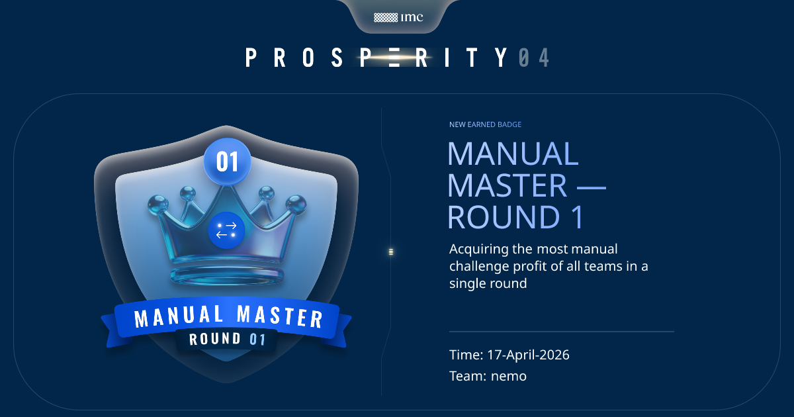

# 📈 IMC Prosperity 4 — Team NEMO
### 🏆 Manual Rank 1 (Round 1) | Final Standings: #1075 Manual, #1501 Overall

Welcome to the official repository for **Team NEMO's** participation in the **IMC Prosperity 4** challenge. This project serves as a comprehensive learning journal and technical showcase of our journey through quantitative finance, game theory, and algorithmic trading.

We achieved **Rank 1 Globally** in Manual Round 1 and finished #1501 overall among 20,000+ global participants. 


*Visual proof of our Rank 1 performance in the Manual Round 1 Stale-Book Auction.*


*Final Competition Standings: #1075 Manual Rank | #1501 Overall Rank.*

---

## 🌊 The Algorithmic Journey: Round by Round

Our algorithmic trading strategy evolved significantly over the competition, driven by our **"6-Lens Analytical Framework"** (Price Shape, Distribution, Volatility, Autocorrelation, Viability Ratio, and Trade Flow).

### Rounds 1 & 2: Foundations & Market Making
*   **Products traded:** `INTARIAN_PEPPER_ROOT`, `ASH_COATED_OSMIUM`
*   **What we did:** We implemented a "Wall-Mid" market-making strategy. We identified that PEPPER had a perfect linear drift (+0.1/tick) requiring a directional trend-following approach, while OSMIUM was a stationary random walk suited for mean-reversion. 
*   **Innovation:** We used Level-2 order book depth to calculate volume-weighted midpoints, providing a much more stable fair value anchor than standard top-of-book prices.

### Round 3: The Options Entry (The Learning Curve)
*   **Products traded:** `HYDROGEL_PACK`, `VELVETFRUIT_EXTRACT` (VEV), and 10 Options Vouchers
*   **What we did:** We expanded our market-making to the new underlying assets but struggled to price the newly introduced options vouchers.
*   **What we learned:** Our initial run resulted in a loss (-2,740 XIRECs) because we attempted to guess directional movements on options. This taught us a hard lesson: **Options require a volatility-aware mathematical model (like Black-Scholes), not directional guessing.**

### Rounds 4 & 5: Volatility Arbitrage & "The Marks"
*   **What we did:** We successfully implemented a Black-Scholes pricing model. By analyzing the data, we discovered the IMC bots had their implied volatility locked at **20.3%**, while actual realized volatility was consistently **34.4%**. 
*   **The Edge:** This massive 1.7x gap meant options were structurally underpriced. We pivoted to aggressively **buy underpriced OTM vouchers** (long gamma).
*   **Counterparty Behavioral Analysis:** We used revealed counterparty IDs to build real-time ledgers. We identified "Mark 14" as smart money (we followed them) and "Mark 38" as noise traders (we faded them). This resulted in our peak algorithmic performance of **+25.8k XIRECs**.

---

## 📰 Manual Rounds: Game Theory & Mathematics

Our manual rounds were where our game theory strategies shined, accumulating ~382,000 XIRECs total (2.5x the target).

*   **Round 1 (Rank 1 Globally):** We mastered the "Stale-Book Auction," bidding just above the queue top to guarantee price priority while securing an extremely favorable clearing price. This earned us the #1 rank in the world for this round.
*   **Round 2 (+201k XIRECs):** A resource allocation challenge where we used calculus to derive the optimal Research-to-Scale ratio (23:77) and Bayesian synthesis of past competitions to predict where the crowd would cluster. We achieved 92.4% of the theoretical maximum, placing #131 globally in this round.
*   **Round 3 (+74k XIRECs):** A two-bid auction where we learned that human crowds overshoot the theoretical Nash equilibrium much more aggressively than academic models predict.
*   **Round 4 (+17k XIRECs):** We identified a **Risk-Free Chooser Arbitrage** using the **Stulz Formula**. We learned that mathematical expectation is a far safer anchor than 100-path Monte Carlo simulations, which can introduce high variance.
*   **Round 5:** A news-based portfolio allocation task where we used a formalized mathematical tier system based on the severity of news events.

---

## 🧠 Key Takeaways & Lessons Learned

1.  **Suspiciously clean numbers are algorithmic tells:** A linear slope of exactly 0.001000 or a perfectly constant Implied Volatility is not market noise; it is a hardcoded bot parameter waiting to be exploited.
2.  **Beware of Rounding Artifacts:** A lag-1 autocorrelation of -0.5 is often a mirage caused by the tick-size rounding. We learned to always check higher-order lags to find true signal.
3.  **Robustness beats Peak Optimization:** A "flat-good" strategy that performs consistently across all days is far superior to a "peak-great" strategy that overfits to a single lucky historical day.
4.  **Trust the Math:** In the heat of the competition, drifting from a calculated mathematical optimum to a "safer" feel-based number cost us ~20,000 XIRECs. Pure mathematical execution wins.

---

## 📁 Repository Structure
```text
├── datamodel.py             # Official IMC data model
├── trader.py                # Final algorithmic trading submission
├── JOURNAL_P4.md            # Detailed strategic evolution & manual logs
├── STRATEGY_PLAYBOOK.md     # Engineering & iteration guidelines
├── src/
│   ├── round_1_2/           # Stationary MR & Linear Drift strategies
│   └── round_3_5/           # Volatility Arbitrage & Options models
├── analysis/                # EDA and strategy validation notebooks
└── plots/                   # Visualizations of market data and results
```

---
*Developed by Team NEMO at IIT Bombay (IEOR) | Focused on Quantitative Excellence and Strategic Growth.*
